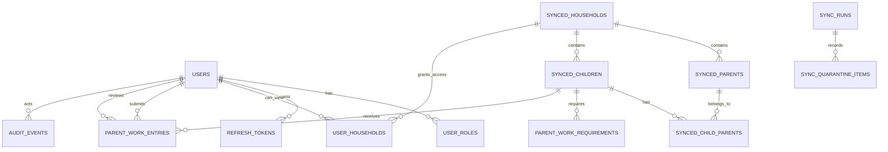

# Portal Data Model Sketch

## Status

| Attribute | Value |
| --- | --- |
| Stand | 2026-05-25 |
| Phase | Phase 0: Datenmodell skizzieren |
| Scope | Portal identity, refresh-token sessions, read-only master-data snapshots, parent-work entries, audit |
| Migration | `backend-portal/migrations/000001_initial_schema.up.sql` |
| Database | `kita` database, `portal` schema |

This document is the Phase 0 handoff sketch for the portal data model. The current implementation follows this sketch in the initial portal migration.

## Boundaries

- The `portal` schema owns portal identity, roles, session state, parent-work data, email outbox state, audit events, and read-only master-data snapshots.
- `backend-fees` remains the source of truth for households, parents, and children during the MVP.
- The portal backend must not write to existing `fees` schema tables.
- Master-data imports land in `portal.synced_*` tables and are matched by `(source_system, source_id)`.
- Portal users are linked to households through `portal.user_households`; users do not store child or fee-system ownership directly.
- Parent-work entries reference `portal.synced_children`, not source-system child rows.
- Parent-work audit is stored in the generic `portal.audit_events` table. A separate `parent_work_audit` table is intentionally not part of Phase 0.

## High-Level ER Diagram

## Identity and Session Tables

### `portal.users`

Portal account record.

Key fields:

| Field | Purpose |
| --- | --- |
| `id` | Portal-local stable UUID |
| `email` | Login identifier, unique by `LOWER(email)` |
| `password_hash` | Bcrypt password hash; nullable while invited/onboarding is incomplete |
| `first_name`, `last_name` | Portal display/profile data |
| `status` | `INVITED`, `ACTIVE`, or `DISABLED` |
| `last_login_at` | Last successful login timestamp |
| `created_at`, `updated_at` | Portal lifecycle timestamps |

Boundary:

- Stores portal account and credential state only.
- Does not duplicate child, household, or contribution data.
- An active account becomes useful only through roles and household access links.

### `portal.user_roles`

Many-to-many role assignment for portal users.

Key fields:

| Field | Purpose |
| --- | --- |
| `user_id` | References `portal.users(id)` |
| `role` | `ADMIN`, `BEITRAG`, `VORSTAND`, `LEITUNG`, `TEAM`, or `PARENT` |
| `created_at` | Assignment timestamp |

Boundary:

- Primary key is `(user_id, role)` so each role can be assigned once per user.
- Role names define coarse portal capabilities; fine-grained row access still uses linked households and module-specific checks.

### `portal.refresh_tokens`

Persisted refresh-token sessions.

Key fields:

| Field | Purpose |
| --- | --- |
| `id` | Session UUID |
| `user_id` | Owning portal user |
| `token_hash` | Stored hash of the refresh token; plaintext tokens are never stored |
| `expires_at` | Hard expiry |
| `revoked_at` | Logout, reset, or manual revocation marker |
| `created_at` | Session creation timestamp |

Boundary:

- Access tokens remain stateless JWTs.
- Refresh tokens are server-side revocable by this table.
- Password reset and account disable flows should revoke active rows for the user.

### Adjacent identity tables

| Table | Purpose |
| --- | --- |
| `portal.invitations` | Invite/onboarding token hashes, target roles, accept/revoke audit links |
| `portal.password_reset_tokens` | Short-lived single-use reset token hashes |

## Master-Data Snapshot Tables

The portal stores normalized read-only snapshots of fee-system master data. Every synced aggregate uses a portal-local UUID plus source identity fields.

Common snapshot fields:

| Field | Purpose |
| --- | --- |
| `id` | Portal-local UUID used by portal modules |
| `source_system` | Origin system, for example `fees` |
| `source_id` | Origin row identifier as text |
| `is_active` | Soft-active flag from the source/import view where applicable |
| `last_synced_at` | Last successful import timestamp for this row |
| `source_checksum` | Canonical source-row checksum for change detection |
| `created_at`, `updated_at` | Portal snapshot lifecycle timestamps |

Rules:

- `(source_system, source_id)` is unique per synced entity table.
- Portal modules reference the portal-local `id`, not the source row directly.
- The snapshot tables keep normalized columns needed by the MVP; raw rejected/conflicting payloads live in `portal.sync_quarantine_items`.
- If a source row disappears or becomes inactive, the import should mark the snapshot inactive instead of deleting rows that may already be referenced by parent-work history.

### `portal.synced_households`

Family/household snapshot.

Entity fields:

| Field | Purpose |
| --- | --- |
| `display_name` | Human-readable household label |
| common snapshot fields | Source identity and sync metadata |

Used by:

- `portal.user_households` to grant parent account access.
- `portal.synced_parents` and `portal.synced_children` as the household grouping.

### `portal.synced_parents`

Parent/guardian snapshot.

Entity fields:

| Field | Purpose |
| --- | --- |
| `household_id` | Optional link to `portal.synced_households` |
| `first_name`, `last_name` | Parent name snapshot |
| `email`, `phone` | Contact snapshot used for matching/invite preparation |
| common snapshot fields | Source identity and sync metadata |

Boundary:

- Contact values are snapshots. Account login email is still stored on `portal.users`.
- Sync can use email for matching, but email alone is not the long-term relationship key.

### `portal.synced_children`

Child snapshot.

Entity fields:

| Field | Purpose |
| --- | --- |
| `household_id` | Optional link to `portal.synced_households` |
| `first_name`, `last_name` | Child name snapshot |
| `birth_date` | Required for identity/display and later policy checks |
| `entry_date`, `exit_date` | Active period basis for parent-work required-hours calculation |
| `group_name` | MVP display snapshot; not a full group model yet |
| common snapshot fields | Source identity and sync metadata |

Used by:

- `portal.parent_work_requirements`
- `portal.parent_work_entries`

### `portal.synced_child_parents`

Join table between synced children and synced parents.

Key fields:

| Field | Purpose |
| --- | --- |
| `child_id` | References `portal.synced_children(id)` |
| `parent_id` | References `portal.synced_parents(id)` |
| `is_primary` | MVP hint for primary contact/display |
| `created_at` | Link creation timestamp |

### `portal.user_households`

Portal access bridge between account users and synced households.

Key fields:

| Field | Purpose |
| --- | --- |
| `user_id` | References `portal.users(id)` |
| `household_id` | References `portal.synced_households(id)` |
| `created_at` | Access link creation timestamp |

Boundary:

- Parent users see children through household membership.
- Staff/admin roles may have broader module access, but this table is still the explicit account-to-household relationship for parent self-service.

## Sync Operation Tables

### `portal.sync_runs`

Import batch journal.

Tracks `source_system`, run status, start/completion timestamps, imported row counts, quarantine count, and an error message.

### `portal.sync_quarantine_items`

Rejected/conflicting source payloads that need manual review.

Key fields:

| Field | Purpose |
| --- | --- |
| `sync_run_id` | Optional link to the import run |
| `source_system`, `source_entity`, `source_id` | Source identity context |
| `reason` | Human-readable conflict/rejection reason |
| `payload` | Raw JSON payload for diagnosis |
| `status` | `OPEN`, `RESOLVED`, or `IGNORED` |
| `resolved_by`, `resolved_at`, `resolution_note` | Manual resolution metadata |

## Parent-Work Tables

### `portal.parent_work_requirements`

Per-child, per-Kita-year required-hours record.

Key fields:

| Field | Purpose |
| --- | --- |
| `child_id` | References `portal.synced_children(id)` |
| `kita_year_start_year` | Start year of the Kita year, for example `2026` for `2026-08-01` to `2027-07-31` |
| `required_hours` | Calculated baseline requirement |
| `override_hours` | Optional manual override |
| `effective_required_hours` | Generated value: `COALESCE(override_hours, required_hours)` |
| `override_reason`, `override_by`, `overridden_at` | Override audit context |
| `exemption_reason` | Reason when requirement is effectively reduced/exempted |
| `calculated_at` | Timestamp of rule calculation |
| `created_at`, `updated_at` | Lifecycle timestamps |

Rules:

- Unique key is `(child_id, kita_year_start_year)`.
- Required and override hours must be non-negative.
- The current rule implementation lives in `backend-portal/internal/service/parent_work_rules.go`.

### `portal.parent_work_entries`

Submitted parent-work entry.

Key fields:

| Field | Purpose |
| --- | --- |
| `child_id` | References `portal.synced_children(id)` |
| `submitted_by` | Portal user who submitted/backfilled the entry |
| `work_date` | Date work was performed |
| `duration_hours` | Submitted duration, greater than zero |
| `approved_duration_hours` | Reviewer-corrected duration, greater than zero when set |
| `category` | MVP category label |
| `description` | Required description |
| `status` | `SUBMITTED`, `APPROVED`, `REJECTED`, or `VOIDED` |
| `review_note` | Reviewer note; required for rejected entries |
| `reviewed_by`, `reviewed_at` | Reviewer metadata for reviewed states |
| `created_at`, `updated_at` | Lifecycle timestamps |

Rules:

- Rejected entries require a non-empty `review_note`.
- `APPROVED`, `REJECTED`, and `VOIDED` entries require `reviewed_by`.
- Only approved hours should count toward fulfilled parent-work totals.
- `approved_duration_hours` allows the reviewer to correct the counted amount without rewriting the originally submitted `duration_hours`.

## Audit

### `portal.audit_events`

Generic audit journal for portal security and business events.

Key fields:

| Field | Purpose |
| --- | --- |
| `actor_user_id` | Optional acting portal user |
| `action` | Stable action name, for example `parent_work.entry.approved` |
| `entity_type` | Entity namespace, for example `parent_work_entry` |
| `entity_id` | Entity UUID when applicable |
| `ip_address`, `user_agent` | Request context |
| `metadata` | JSON details such as old/new status, corrected hours, or sync reason |
| `created_at` | Audit timestamp |

Parent-work audit actions should cover:

- Entry created/submitted.
- Entry approved.
- Entry rejected.
- Entry duration corrected during approval.
- Entry voided.
- Requirement overridden or exemption recorded.
- Reminder previewed/sent.

## Implementation Status and Gaps

Implemented:

- Initial PostgreSQL schema in `backend-portal/migrations/000001_initial_schema.up.sql`.
- Portal auth login, refresh, current-user, and logout endpoints use `portal.users`, `portal.user_roles`, and `portal.refresh_tokens`.
- Parent-work required-hours rule is implemented and tested in Go.

Pending:

- Invite/onboarding and password-reset API flows.
- Master-data sync job and quarantine review API/UI.
- Parent-work submission, review, overview, and reminder APIs.
- Audit-event writes for auth, sync, and parent-work actions.
